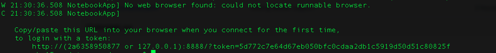

# PYData LA: When Rotten Tomatoes Isn't Enough Tutorial 

In this tutorial, we’ll use sentiment analysis on Twitter data about the latest movie titles to answer that age old question: “Is that movie any good?” We’ll show how we built the solution using Apache Cassandra, Apache Spark, DataStax Enterprise Analytics, Python and Jupyter notebooks. This is a great tutorial to attend if you are new to big data or want to learn more about Cassandra and Spark!

#### Install Docker 
#### Download DataStax Docker Image
#### Open Jupyter

### Install Docker
* Download correct Docker Community Edition: https://store.docker.com/search?type=edition&offering=community
* Create Log In to Download
* Download Docker

### Change Memory For Docker
* Allow for 5 GB of Memory per container
* Docker -> Preferences -> Advanced -> Memory

### Download DSE/Jupyter Image
* cd **YourDownloadPath**/pydata
* docker-compose up -d (Should take 6 minutes but will also start DataStax Enterprise, Spark, and Juypter)

### Open Jupyter
* Once download and start is complete 
* Login with token that is in Jupyter logs
* docker logs pydata_jupyter_1 

* Example: http://127.0.0.1:8889/?token=dcd21bc3a1c1331c6c61d51fb5a9d64c72fca7f4b2a6000e
* Navigate to notebooks directory!! 
* Open When Rotten Tomatoes isn’t Enough CSV.ipynb 
